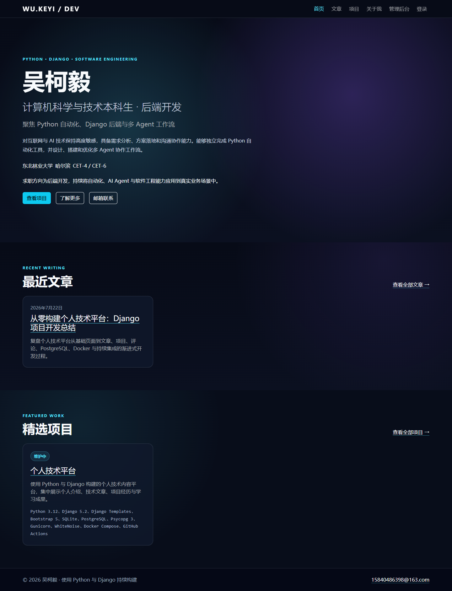
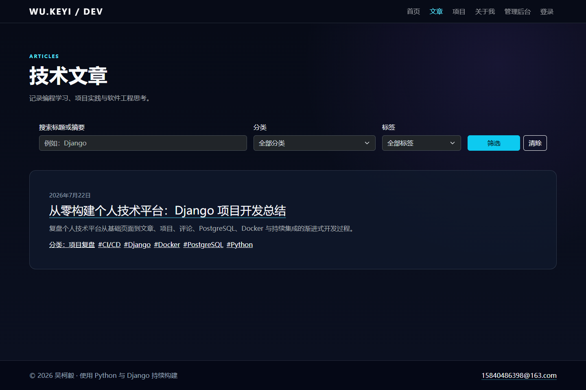
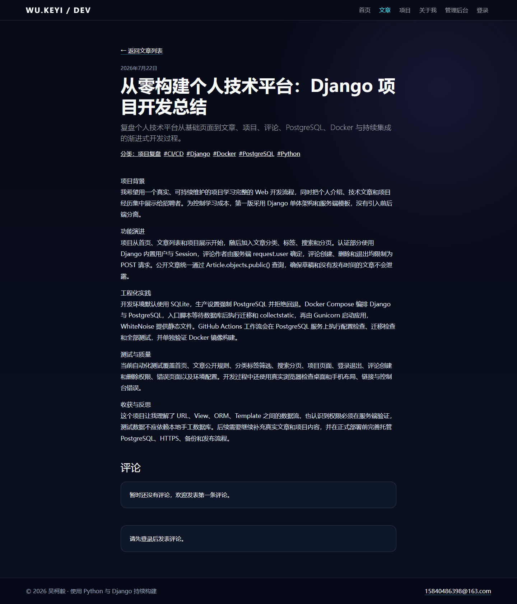
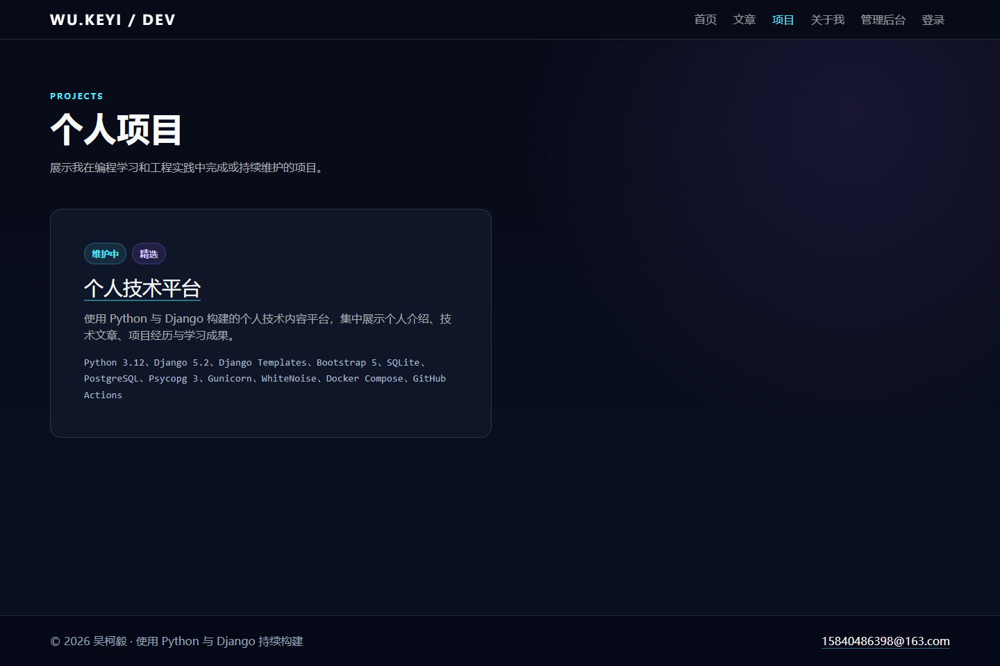
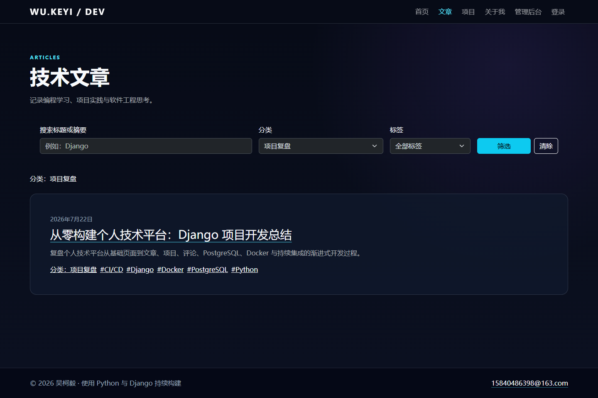
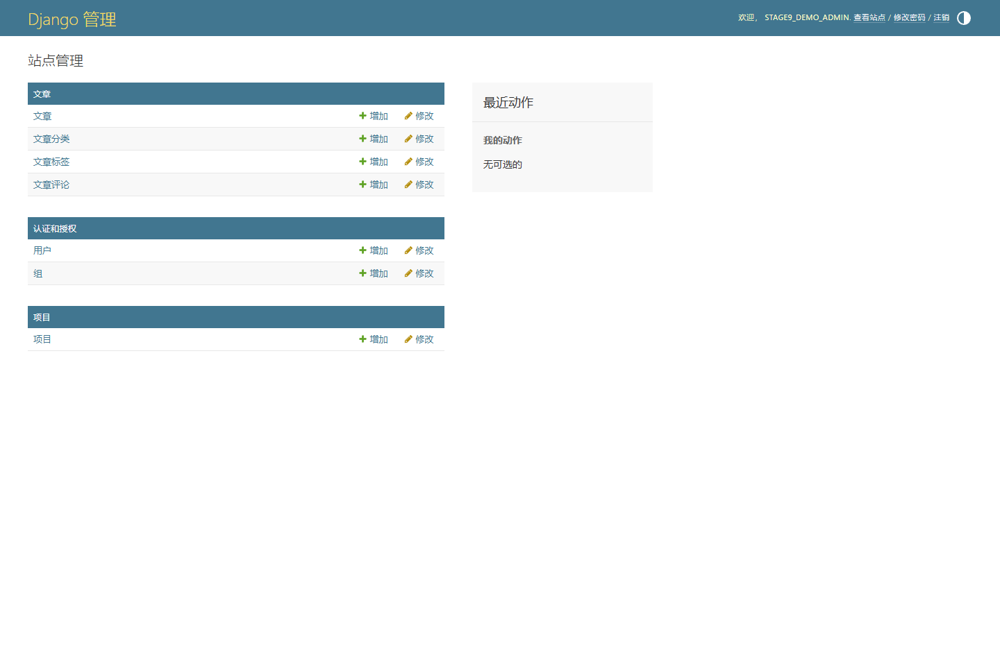

# 个人技术平台

[](https://github.com/key-R7/personal-tech-platform/actions/workflows/ci.yml)

> 使用Django服务端渲染构建的个人技术平台，覆盖内容管理、文章检索、项目展示、Session认证、评论权限、PostgreSQL、Docker与持续集成。

当前状态：核心功能完成；本地SQLite、Docker PostgreSQL、GitHub Actions和Render公网部署均已验证通过。

[在线演示](https://personal-tech-platform.onrender.com/) · [GitHub仓库](https://github.com/key-R7/personal-tech-platform) · [架构说明](docs/architecture.md) · [Render部署](docs/render-deployment.md) · [演示指南](docs/demo-guide.md) · [面试准备](docs/interview-notes.md)

## 项目截图

| 首页 | 文章列表 |
| --- | --- |
|  |  |

| 文章详情与评论 | 项目展示 |
| --- | --- |
|  |  |

| 分类筛选 | Django Admin |
| --- | --- |
|  |  |

评论发布与删除流程截图见[评论功能](docs/images/comments.png)，完整演示顺序见[演示指南](docs/demo-guide.md)。

## 项目解决的问题

这个项目把个人介绍、技术文章、实践项目和联系方式集中到一个可由 Django Admin 维护的平台中。一方面，它为招聘者提供可浏览的作品入口；另一方面，它用一个规模可控的单体应用完整演示 URL 路由、ORM、模板、Session 权限、测试、容器化和持续集成。

## 当前功能

- 首页、About 页面、统一导航和页脚
- 文章列表、详情、分类、标签、关键词搜索和分页
- 项目列表、详情和精选项目
- Django Admin 内容管理
- Django 内置登录和安全的 POST 退出
- 评论创建、作者删除和 staff 管理权限
- 自定义 404、500 页面和控制台日志
- 开发与生产环境设置拆分

公开文章必须同时满足 `status=published` 和 `published_at` 不为空。首页、列表、详情、搜索、筛选和评论入口统一使用 `Article.objects.public()`。

## 技术栈

- Python 3.12
- Django 5.2.16
- Django Templates
- Bootstrap 5.3.8 CDN
- SQLite（默认本地开发）
- PostgreSQL + Psycopg 3（可选配置）
- Django 内置测试框架
- Gunicorn + WhiteNoise
- Docker Compose
- GitHub Actions

## 目录结构

```text
config/
  settings/
    base.py          # 共用设置和环境变量辅助函数
    development.py   # 本地开发：默认SQLite和DEBUG=True
    production.py    # 生产环境：强制PostgreSQL和DEBUG=False
  urls.py
  asgi.py
  wsgi.py
core/                # 首页、About、认证URL和公共上下文
blog/                # 文章、分类、标签和评论
projects/            # 项目展示
templates/           # 全局及页面模板
static/              # CSS和favicon
docs/architecture.md # 系统架构、权限与数据流
docs/render-deployment.md # Render控制台配置与公网验收清单
scripts/             # 轻量仓库检查脚本
.github/workflows/   # GitHub Actions持续集成
Dockerfile           # 生产式Django镜像
compose.yaml         # Django + PostgreSQL本地编排
manage.py            # Django管理命令入口
```

## 系统架构与数据模型

项目采用 Django 单体架构：浏览器访问命名 URL，View 通过 ORM 查询数据，再由 Django Templates 返回 HTML。Docker 运行时由 Gunicorn 承载 WSGI，WhiteNoise 提供收集后的静态文件，PostgreSQL 负责持久化数据。

核心关系如下：

- `Category` 一对多关联 `Article`；
- `Article` 与 `Tag` 是多对多关系；
- Django `User` 和 `Article` 分别一对多关联 `Comment`；
- `Project` 是独立的作品展示模型，通过 `featured` 控制首页精选展示。

更完整的运行关系、请求流程、登录 Session、评论权限和 CI 流程见[架构文档](docs/architecture.md)。

## 5分钟快速运行

```powershell
python -m venv .venv
.\.venv\Scripts\Activate.ps1
python -m pip install -r requirements.txt
python manage.py migrate
python manage.py seed_demo
python manage.py runserver
```

打开<http://127.0.0.1:8000/>。`seed_demo`只创建明确标记的演示数据，不创建用户、不覆盖已有同slug内容，可重复执行。

## 创建环境并安装依赖

PowerShell：

```powershell
python -m venv .venv
.\.venv\Scripts\Activate.ps1
python -m pip install --upgrade pip
python -m pip install -r requirements.txt
```

如果系统禁止激活脚本，可以直接使用：

```powershell
.\.venv\Scripts\python.exe -m pip install -r requirements.txt
```

## 环境变量和 `.env.example`

`.env.example` 是可提交的变量清单，只包含示例值。可以复制为本地 `.env`：

```powershell
Copy-Item .env.example .env
```

项目使用 Python 标准库读取环境变量，不会自动加载 `.env`。复制后仍需在当前 PowerShell 会话设置变量，或在部署平台的环境变量界面配置。`.env`、真实密钥和数据库密码不能提交到 Git。

例如生成并设置开发密钥：

```powershell
$env:DJANGO_SECRET_KEY = python -c "from django.core.management.utils import get_random_secret_key; print(get_random_secret_key())"
$env:DJANGO_DEBUG = "true"
$env:DJANGO_ALLOWED_HOSTS = "localhost,127.0.0.1"
```

开发设置存在明确标注的本地专用密钥，因此不设置 `DJANGO_SECRET_KEY` 也可以启动；建议仍练习通过环境变量设置。该默认值绝不会被生产设置使用。

## 默认SQLite开发方式

`manage.py`、`wsgi.py` 和 `asgi.py` 默认选择 `config.settings.development`。未设置 `DATABASE_ENGINE` 时使用项目根目录的 `db.sqlite3`：

```powershell
python manage.py migrate
python manage.py createsuperuser
python manage.py runserver
```

主要页面：

- 首页：<http://127.0.0.1:8000/>
- 文章：<http://127.0.0.1:8000/articles/>
- 项目：<http://127.0.0.1:8000/projects/>
- About：<http://127.0.0.1:8000/about/>
- 登录：<http://127.0.0.1:8000/accounts/login/>
- 管理后台：<http://127.0.0.1:8000/admin/>

## 本地切换到PostgreSQL

先准备一个可访问的 PostgreSQL 数据库，再在当前终端设置：

```powershell
$env:DATABASE_ENGINE = "postgresql"
$env:DATABASE_NAME = "portfolio"
$env:DATABASE_USER = "portfolio_user"
$env:DATABASE_PASSWORD = "replace-with-real-password"
$env:DATABASE_HOST = "127.0.0.1"
$env:DATABASE_PORT = "5432"
python manage.py migrate
python manage.py runserver
```

端口会被校验并转换为整数。缺少字段、端口无效或引擎名称错误时，Django 会给出明确配置错误。本仓库只完成 PostgreSQL 配置支持；没有内置 PostgreSQL 服务，也不代表已经连接或迁移了真实 PostgreSQL 数据库。

## 生产设置

部署时显式选择生产模块：

```powershell
$env:DJANGO_SETTINGS_MODULE = "config.settings.production"
$env:DJANGO_SECRET_KEY = "replace-with-a-long-random-production-secret"
$env:DJANGO_ALLOWED_HOSTS = "portfolio.your-domain.tld"
$env:DATABASE_ENGINE = "postgresql"
$env:DATABASE_NAME = "portfolio"
$env:DATABASE_USER = "portfolio_user"
$env:DATABASE_PASSWORD = "replace-with-real-password"
$env:DATABASE_HOST = "database.your-provider-host.tld"
$env:DATABASE_PORT = "5432"
python manage.py check
```

生产配置具有以下约束：

- `DEBUG` 始终为 `False`；如果显式设置 `DJANGO_DEBUG=true` 会拒绝启动。
- `DJANGO_SECRET_KEY`、`DJANGO_ALLOWED_HOSTS` 和全部 PostgreSQL 连接字段必须提供。
- 生产环境强制 PostgreSQL，不会静默回退 SQLite。
- `SECURE_CONTENT_TYPE_NOSNIFF` 默认启用。
- 在 HTTPS 已真实可用后，设置 `DJANGO_HTTPS_ENABLED=true` 才会启用安全Cookie、HTTPS跳转和一年HSTS。
- 只有可信反向代理正确设置 `X-Forwarded-Proto` 时，才设置 `DJANGO_TRUST_PROXY_HEADER=true`。
- 跨源 POST 场景可用逗号分隔的`CSRF_TRUSTED_ORIGINS`，例如`https://portfolio.your-domain.tld`。

正式部署前还应执行`python manage.py check --deploy`，确认HTTPS、代理、静态文件和平台日志。CI已配置；当前尚未配置Nginx、云服务器或正式HTTPS。

## 使用Docker Compose运行Django和PostgreSQL

前置条件：安装并启动 Docker Desktop，确认以下命令可用：

```powershell
docker --version
docker compose version
```

复制环境变量示例，并将示例密钥和密码替换为仅供本机使用的随机值：

```powershell
Copy-Item .env.example .env
```

`.env` 会同时提供Django数据库变量和PostgreSQL初始化变量。两组数据库名称、用户和密码必须保持一致。Compose网络中的数据库主机是 `db`，不是 `localhost`；数据库端口只在容器网络中使用，不会默认暴露给宿主机。

检查、构建和启动：

```powershell
docker compose config
docker compose build
docker compose up -d
docker compose ps
```

查看日志：

```powershell
docker compose logs --tail=100 web
docker compose logs --tail=100 db
docker compose logs -f web
```

`db` 健康检查通过后，`web` 才会启动。Web入口脚本会再次使用Django数据库连接进行最多60秒的有限重试，然后依次执行：

1. `python manage.py migrate --noinput`
2. `python manage.py collectstatic --noinput`
3. Gunicorn启动

任何步骤失败都会停止Web容器，不会带着未迁移的数据库继续运行。自动迁移方便本地Compose验证，但多个生产实例同时启动时可能产生迁移竞争；正式部署更适合在独立发布步骤中只执行一次迁移。

容器内验证命令：

```powershell
docker compose exec web python manage.py check
docker compose exec web python manage.py migrate --check
docker compose exec web python manage.py showmigrations
docker compose exec web python manage.py test
docker compose exec web python manage.py shell -c "from django.db import connection; print(connection.vendor)"
docker compose exec web python manage.py check --deploy
```

最后一条数据库类型命令应输出 `postgresql`。`check --deploy` 在本地HTTP环境中可能提示安全警告；不要为了清除警告而在HTTP环境盲目开启HTTPS跳转、Secure Cookie或HSTS。

手动创建管理员：

```powershell
docker compose exec web python manage.py createsuperuser
```

容器使用Gunicorn运行 `config.wsgi:application`。Gunicorn用于稳定管理生产式WSGI worker、超时和访问日志；Django `runserver` 只面向本地开发，不适合作为容器正式入口。

`collectstatic` 将源码静态资源和Admin静态资源收集到镜像内的 `staticfiles` 目录，WhiteNoise在没有Nginx的本阶段负责提供压缩、带内容哈希的静态文件。正式高流量部署仍建议由反向代理、CDN或对象存储提供静态资源。

停止服务但保留PostgreSQL命名卷：

```powershell
docker compose down
```

删除容器和数据库卷：

```powershell
docker compose down -v
```

**警告：`docker compose down -v` 会永久删除本地Compose PostgreSQL数据。普通停止服务不要使用 `-v`。**

常见问题：

- `docker` 命令不存在：安装并启动Docker Desktop，重新打开终端。
- Compose提示变量缺失：检查项目根目录是否存在未提交的 `.env`，并替换示例值。
- `db` 不健康：查看 `docker compose logs db`，核对三项 `POSTGRES_*` 变量。
- Web等待数据库超时：核对Django的 `DATABASE_*` 与 `POSTGRES_*` 是否一致。
- 页面无样式：检查Web日志中的 `collectstatic` 输出，并确认 `/static/css/site.css` 返回成功。
- 修改了首次初始化使用的PostgreSQL密码但旧卷仍存在：旧数据库不会自动改密码；确认数据可删除后才能使用 `down -v` 重新初始化。

本地Compose只是生产式运行验证，尚不包含Nginx、正式HTTPS、云服务器或备份方案。

## Render公网部署

项目的Docker镜像可以直接用于Render Web Service：Gunicorn监听Render提供的`PORT`，入口脚本在启动前等待PostgreSQL、执行迁移和收集静态文件，再由WhiteNoise提供静态资源。

当前公网地址为[personal-tech-platform.onrender.com](https://personal-tech-platform.onrender.com/)。首次部署已经验证Docker构建、PostgreSQL迁移、`collectstatic`、Gunicorn启动、桌面与390px手机布局、Admin登录页和自定义404页面。

Render控制台的服务、数据库、环境变量、管理员创建和公网验收步骤见[Render部署清单](docs/render-deployment.md)。该文档只提供变量名称与填写规则，不包含真实密钥或数据库凭据。

## 内容管理、登录和评论

项目没有开放注册。管理员通过 `/admin/` 创建用户和内容，普通用户使用 `/accounts/login/` 登录。

- 评论作者来自 `request.user`，文章来自服务端URL，客户端不能伪造。
- 评论创建、删除和退出只接受 POST，并启用 CSRF 防护。
- 普通用户只能删除自己的评论，staff 可以删除任意评论。
- 评论使用 Django 默认模板转义，避免脚本注入。

## 检查和测试

```powershell
python manage.py check
python manage.py makemigrations --check --dry-run
python manage.py test
python scripts/check_repository.py
```

测试不依赖本地 `db.sqlite3` 中的手工数据；Django 会建立并销毁独立测试数据库。

## GitHub Actions持续集成

`.github/workflows/ci.yml` 在推送到 `main`、针对 `main` 的 Pull Request 和手动触发时运行。相同分支出现新任务时，会取消旧的未完成任务。

持续集成包含两个 Job：

1. 使用 Python 3.12.13 和 PostgreSQL 18 服务安装 `requirements.txt`，检查已跟踪敏感文件、Django 配置、遗漏迁移，实际执行迁移并确认 `connection.vendor` 为 `postgresql`，收集生产静态文件后运行全部测试；
2. 在测试通过后执行 `docker build --tag personal-tech-platform:test .`，只检查镜像构建，不推送镜像或部署。

工作流只使用明确标注的临时CI密钥和数据库密码，不读取`.env`。当前`main`分支工作流已经在GitHub真实运行并通过，CI状态以README顶部徽章和仓库Actions页面为准。

## 安全设计

- 公开文章统一经过 `Article.objects.public()`，草稿及没有发布时间的文章不能通过公开 URL 查看或评论；
- 评论作者来自 `request.user`，文章来自服务端 slug 查询，客户端不能指定；
- 评论创建、删除和退出只接受 POST，并由 CSRF 中间件保护；
- 普通用户只能删除自己的评论，staff 可管理全部评论，权限在服务端检查；
- Django 模板默认转义用户内容，当前没有对评论正文使用 `safe`；
- 生产设置拒绝 `DEBUG=True` 和 SQLite 回退，并要求密钥、主机与 PostgreSQL 参数；
- `.gitignore` 与 `.dockerignore` 排除 `.env`、数据库、日志、虚拟环境、媒体和 `staticfiles`；CI 再检查这些路径是否被 Git 跟踪。

## 修改个人资料内容

首页、About页面和页脚共用的个人资料位于`core/context_processors.py`中的`SITE_PROFILE`。当前姓名、教育背景、技能方向、语言能力和邮箱来自作者简历；未提供的GitHub地址不会渲染为空链接，出生日期和手机号不进入公开仓库。

## 当前限制与下一步

- 已在本地Docker Compose和Render PostgreSQL中验证连接与迁移，但没有把本地SQLite内容迁移到公网数据库；公网目前是空数据状态。
- Bootstrap依赖CDN，离线环境样式可能不完整。
- 尚未实现用户注册、评论回复/审核、图片上传和Markdown编辑器。
- Render Free Web Service无访问时会休眠，首次访问可能需要约一分钟唤醒。
- Render Free PostgreSQL会在2026年8月21日到期并被删除，且不提供备份；长期公开展示前必须升级或迁移数据库。
- 公网环境尚未创建管理员账号和正式展示内容，登录、评论及Admin写入流程仍需在创建账号后进行人工验收。
- `seed_demo`仅用于本地界面验证，正式展示内容仍应由作者在Admin中维护。

下一步应安全创建公网管理员、录入真实文章与项目、完成登录和评论权限验收，并用公网内容重新拍摄README截图。不要在仓库、文档或聊天中记录管理员密码和数据库凭据。
