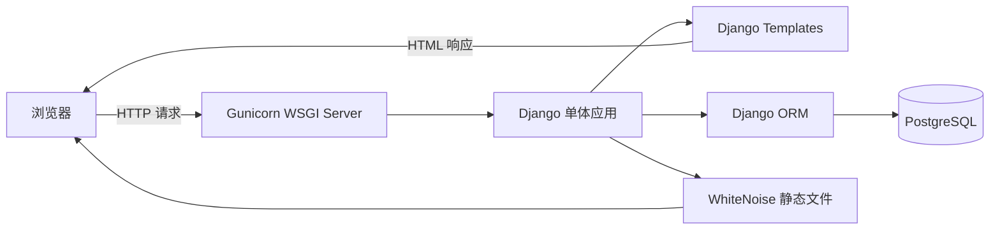
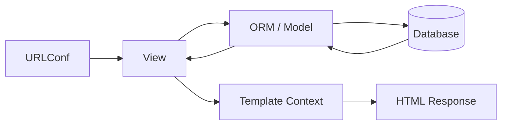
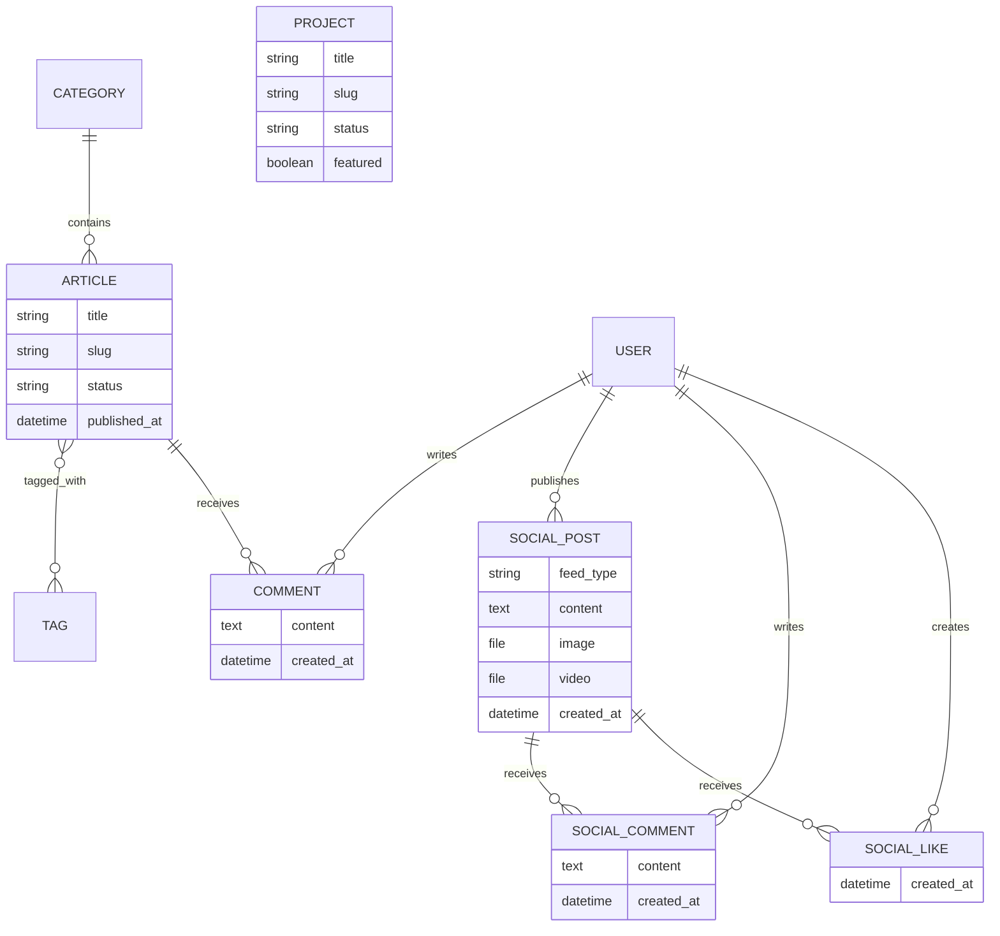
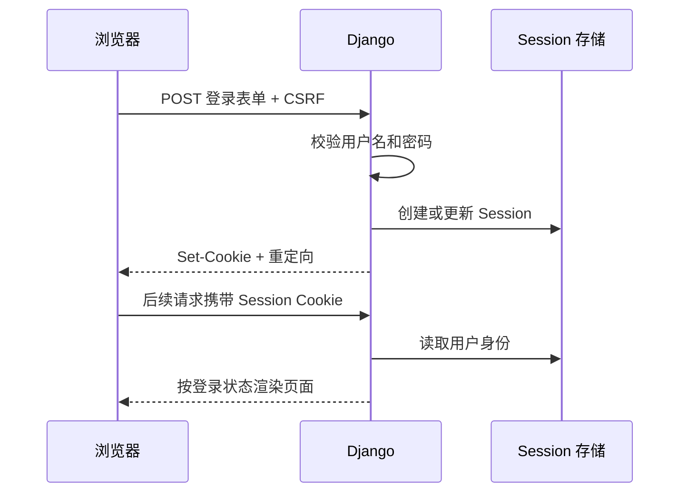
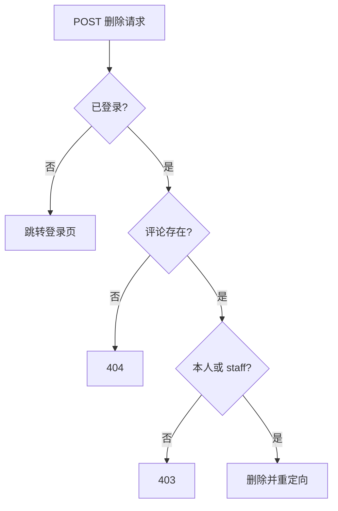
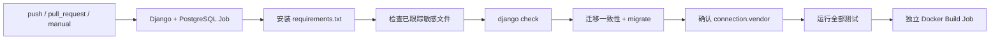

# 系统架构与数据流

本项目是一个 Django 单体应用。浏览器接收服务端渲染的 HTML，不存在前后端分离 API。开发环境可直接使用 SQLite；Docker 环境由 Gunicorn 运行 Django，并连接独立 PostgreSQL 容器。

## 运行时架构

在本地开发时，`runserver` 代替 Gunicorn，SQLite 文件代替 PostgreSQL 服务。Compose 中 `web` 与 `db` 位于同一内部网络，`web` 使用主机名 `db` 访问数据库；数据库端口默认不暴露给宿主机。

## Django 请求数据流

一次普通页面请求依次经过：

1. `config/urls.py` 将请求分发到应用 URLConf。
2. 应用的命名 URL 将请求交给 View。
3. View 使用 ORM 查询 Model，并完成公开范围和权限判断。
4. View 把数据放入 Template Context。
5. Template 继承 `base.html` 生成 HTML 响应。

## 核心数据模型

`Project` 当前是独立展示模型，不与文章或用户建立关系。`SocialPost`使用统一模型并以`feed_type`隔离Personal Feed和Circle Feed；`SocialLike`对`post + user`设置唯一约束。

首页和About分别使用`HomePageContent`与`AboutPageContent`单例式配置模型。Admin保存后页面读取数据库最新内容；没有记录时回退到已核实的静态个人资料。

## 文章公开规则

所有公开入口统一从 `Article.objects.public()` 开始查询。它同时要求：

- `status="published"`；
- `published_at` 不为空。

首页、文章列表、详情、搜索、分类/标签筛选以及评论创建入口都复用该规则。因此，即使访问者猜到 slug，草稿或没有发布时间的文章也会返回 404。

## 登录与 Session

项目使用 Django 内置认证和服务端 Session，不保存明文密码，也不使用 JWT。退出登录仅接受 POST。

## 评论创建流程

1. 登录用户向文章 slug 对应的评论创建 URL 提交 POST 和 CSRF Token。
2. View 通过 `Article.objects.public()` 获取文章；非公开文章返回 404。
3. `CommentForm` 只验证评论正文。
4. 服务端将 `request.user` 设为作者，将 URL 查到的文章设为所属文章。
5. 保存后重定向回文章详情页。

浏览器不能通过表单伪造评论作者或目标文章。

## 评论删除权限

GET 不会删除评论；权限在 View 中执行，不能通过隐藏或伪造前端按钮绕过。

## 社交动态数据流与权限

- Personal Feed只查询`feed_type=personal`，首版只允许staff通过Admin创建；
- Circle Feed只查询`feed_type=circle`，登录用户通过ModelForm提交；
- View忽略客户端的`author`和`feed_type`，分别固定为`request.user`和`circle`；
- 点赞、评论、删除全部使用POST，游客跳转登录；
- 动态或评论作者只能删除自己的内容，staff可以删除任意内容，越权返回403；
- Feed使用`select_related("author")`、评论预取、聚合计数和`Exists`标记当前用户点赞状态，避免逐条查询。

## 配置与环境差异

| 项目 | 本地开发 | Docker / 生产式运行 |
| --- | --- | --- |
| 设置模块 | `config.settings.development` | `config.settings.production` |
| Web Server | Django `runserver` | Gunicorn |
| 数据库 | 默认 SQLite，可切 PostgreSQL | 强制 PostgreSQL |
| `DEBUG` | 默认 `True` | 始终 `False` |
| 密钥 | 明确标注的开发默认值或环境变量 | 必须由环境变量提供 |
| 静态文件 | Django 开发服务 | `collectstatic` + WhiteNoise |
| 上传媒体 | `MEDIA_ROOT` + 开发媒体路由 | Compose命名卷；公网需持久磁盘或对象存储 |

`base.py` 定义环境变量解析和公共配置；`development.py` 与 `production.py` 负责环境差异。生产设置缺少关键变量、尝试启用 DEBUG 或尝试回退 SQLite 时会明确失败。

## 容器启动流程

`compose.yaml` 先启动 `db` 并等待健康检查。`web` 的入口脚本再有限重试数据库连接，依次执行 `migrate`、`collectstatic`，最后通过 `exec` 启动 Gunicorn。PostgreSQL与上传媒体分别存放在命名卷中，普通`docker compose down`会保留它们；`docker compose down -v`会永久删除两个卷。

Render当前没有持久化`/app/media`。在未挂载持久磁盘或接入对象存储前，公网容器重启或重新部署会丢失上传文件。

## GitHub Actions 检查流程

CI 使用一次性的 PostgreSQL 服务和明确标注的非生产测试凭据。它不读取 `.env`，不推送镜像、不提交代码，也不执行部署。
